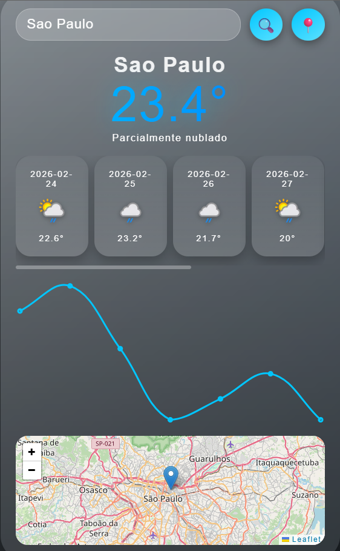

# 📱 iOS Weather Clone

 
 


Clone do **iOS Weather**, inspirado no iOS 17, com **fundo dinâmico**, **forecast 3D**, **gráfico interativo** e **animações de chuva/neve**.

---

## 🌟 Preview Geral



---

## ✨ Funcionalidades

- 🔍 Buscar clima por cidade ou geolocalização  
- 🌈 Fundo animado conforme o clima  
- 🗓 Forecast semanal em **cards 3D**  
- 📊 Gráfico interativo com **Chart.js**  
- 🗺 Mapa interativo com **Leaflet.js**  
- ❄️ Animações de chuva e neve  
- 📱 Design responsivo com scroll suave  

---

## 💻 Tecnologias

- **HTML5**  
- **CSS3** (Glassmorphism, Gradientes, Transições, Scroll suave)  
- **JavaScript** (Vanilla JS, fetch API)  
- [**Chart.js**](https://www.chartjs.org/)  
- [**Leaflet.js**](https://leafletjs.com/)  
- [**WeatherAPI**](https://www.weatherapi.com/)  

---

## 🚀 Como Usar

1️⃣ **Clone o repositório**  

```bash
git clone https://github.com/seu-usuario/ios-weather-clone.git
